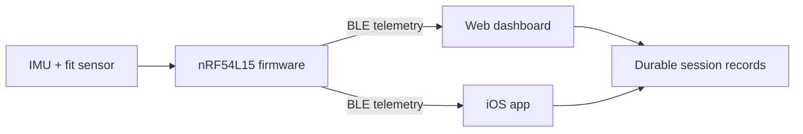

  

# Kyntex

Kyntex is a wearable-sensing platform built around a single idea: training
telemetry you can actually trust. Most wearables render attractive live charts
but cannot tell you whether the device was fitted correctly or whether the whole
session was captured without silent data loss. Kyntex is engineered from the
sensor up to answer both questions — fit-gated capture, versioned Bluetooth Low
Energy telemetry with recording-integrity counters, and durable storage that
preserves long sessions for later analysis.

The current prototype measures motion and band fit, classifies activity, and
derives engineering training-load metrics on-device. It is a fully working,
end-to-end system: firmware, a custom BLE protocol, and two companion
applications, engineered by a single developer.

## Current prototype

| Layer | Implementation |
| --- | --- |
| Embedded platform | Seeed Studio XIAO nRF54L15 Sense |
| Firmware | nRF Connect SDK and Zephyr RTOS |
| Custom hardware | Fabricated NINA-B302/nRF52 V1 PCB; power and SWD/J-Link verified |
| Sensors | onboard six-axis IMU and external force-sensitive resistor |
| Connectivity | versioned BLE telemetry with packet and sample integrity counters |
| Applications | dependency-free web dashboard and native SwiftUI iOS app |
| Session data | bounded summaries plus durable raw-sample recording and export |
| Project role | Ben Harris — co-founder and sole engineer (firmware, protocol, apps, hardware) |

The prototype currently supports motion telemetry, band-fit feedback, session
state, steps, jumps, activity labels, and engineering training-load estimates.
These values are intended for product development and personal trend review;
they are not validated clinical measurements.

## Hardware development

Hardware work on Kyntex spans prototype integration, custom schematic and PCB
design, fabrication, and bench bring-up using KiCad and Altium Designer. The
custom NINA-B302/nRF52 V1 board powers on and supports J-Link/SWD programming;
several sensor interfaces remain under investigation and are not presented as
fully validated.

- [Hardware design and bring-up documentation](docs/hardware/README.md)
- [Altium documentation workspace](docs/hardware/altium/README.md)

## System overview

## Scope of work

All engineering on Kyntex is designed, built, and maintained by a single
engineer. That scope covers:

- **Firmware** — a Zephyr RTOS application on the Nordic nRF54L15: event-driven
  IMU acquisition, band-fit sensing, battery monitoring, and an on-device
  workout engine that classifies activity and counts steps, jumps, and load.
- **Protocol** — a custom, versioned binary BLE contract with checksums and
  recording-integrity counters, kept in lockstep across three language
  implementations.
- **Applications** — a native SwiftUI/CoreBluetooth iOS app and a
  dependency-free Web Bluetooth dashboard, both decoding the same device data.
- **Hardware** — schematic and PCB design in KiCad and Altium, fabrication, and
  bench bring-up of a custom NINA-B302/nRF52 board.

## Engineering principles

- Preserve compatibility through explicit protocol and release versions.
- Make recording gaps visible instead of silently treating data as complete.
- Keep live memory bounded during long sessions.
- Prefer explainable algorithms until labeled validation data supports a
  learned model.
- Describe sensor-derived metrics conservatively and keep medical claims out of
  the current product.

## Explore the project

- [Problem and design goals](docs/problem.md)
- [Current solution](docs/solution.md)
- [Technical architecture](docs/technology.md)
- [Hardware design and bring-up](docs/hardware/README.md)
- [Altium documentation workspace](docs/hardware/altium/README.md)
- [Development roadmap](docs/roadmap.md)
- [Hardware-free software demo](docs/demo.md)
- [Public technical portfolio](https://github.com/Kyntex-org/Kyntex-Technical-Public)

Production firmware and product-specific protocol details are developed in a
private repository. Public repositories contain selected material appropriate
for portfolio review and technical discussion.

## Development status

Kyntex is an active engineering prototype on a deliberate path toward a real
product. The software stack works end to end today; the remaining gap to
production is honestly scoped rather than glossed over. Hardware validation,
signed firmware updates and authenticated device access, per-device calibration
storage, and multi-subject metric validation are all tracked as open work in the
[roadmap](docs/roadmap.md).

The longer-term research bet is tendon-response sensing — using the band to say
something useful about tissue behavior rather than only body movement. That
would require dedicated excitation and sensing hardware plus controlled
validation, so it is named as a research direction and never as a current
capability.

## Disclaimer

Kyntex is not a medical device and is not intended to diagnose, treat, prevent,
or predict injury. See [LICENSE](LICENSE) for repository usage terms.
