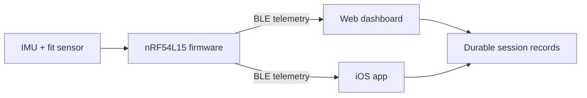

  

# Kyntex

Kyntex is a wearable-sensing platform for reliable training-session telemetry.
The current prototype measures motion and band fit, streams versioned data over
Bluetooth Low Energy, and preserves long sessions for later analysis.

## Current prototype

| Layer | Implementation |
| --- | --- |
| Embedded platform | Seeed Studio XIAO nRF54L15 Sense |
| Firmware | nRF Connect SDK and Zephyr RTOS |
| Sensors | onboard six-axis IMU and external force-sensitive resistor |
| Connectivity | versioned BLE telemetry with packet and sample integrity counters |
| Applications | dependency-free web dashboard and native SwiftUI iOS app |
| Session data | bounded summaries plus durable raw-sample recording and export |

The prototype currently supports motion telemetry, band-fit feedback, session
state, steps, jumps, activity labels, and engineering training-load estimates.
These values are intended for product development and personal trend review;
they are not validated clinical measurements.

## System overview

## Engineering principles

- Preserve compatibility through explicit protocol and release versions.
- Make recording gaps visible instead of silently treating data as complete.
- Keep live memory bounded during long sessions.
- Prefer explainable algorithms until labeled validation data supports a
  learned model.
- Describe sensor-derived metrics conservatively and keep medical claims out of
  the current product.

## Explore the project

- [Problem and design goals](docs/problem.md)
- [Current solution](docs/solution.md)
- [Technical architecture](docs/technology.md)
- [Development roadmap](docs/roadmap.md)
- [Hardware-free software demo](docs/demo.md)
- [Public technical portfolio](https://github.com/Kyntex-org/Kyntex-Technical-Public)

Production firmware and product-specific protocol details are developed in a
private repository. Public repositories contain selected material appropriate
for portfolio review and technical discussion.

## Development status

Kyntex is an active engineering prototype. The nRF54 software stack is in
production-readiness development; hardware validation, secure update design,
per-device calibration, and broader field testing remain ongoing work.

Longer-term research may investigate tendon-response sensing. That work remains
a research direction and is not a capability of the current prototype.

## Disclaimer

Kyntex is not a medical device and is not intended to diagnose, treat, prevent,
or predict injury. See [LICENSE](LICENSE) for repository usage terms.
