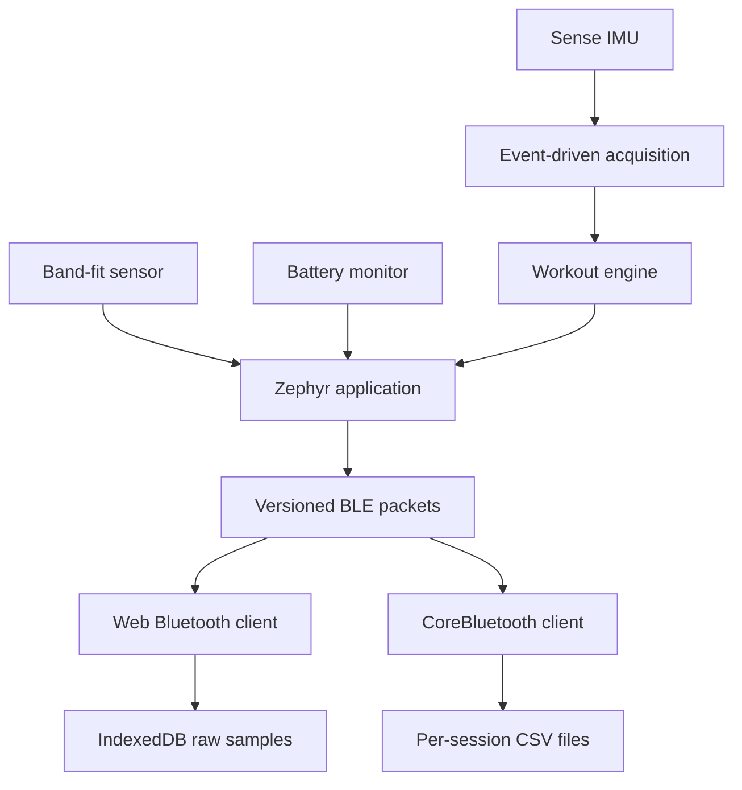

# Technical architecture

## Data path

## Embedded stack

- Seeed Studio XIAO nRF54L15 Sense application core
- Nordic nRF Connect SDK with Zephyr RTOS
- Zephyr sensor, GPIO, ADC, regulator, and Bluetooth APIs
- interrupt-driven IMU sampling with a timed fallback
- hardware floating point and fixed-duration feature windows

Development flashing currently uses the module's USB-C-connected CMSIS-DAP
probe. A production board should expose SWDIO, SWCLK, RESET, ground, and target
voltage for a J-Link or pogo-pin fixture. Secure boot, signed updates, and
device-specific calibration storage remain separate production milestones.

## Custom hardware

The fabricated V1 PCB uses a NINA-B302 module based on the Nordic nRF52
architecture. Initial bring-up verified power and J-Link/SWD access. Sensor
interfaces are still being debugged, so the board is documented as an active
engineering prototype rather than a fully validated product revision.

Public hardware material is organized in the
[hardware portfolio](hardware/README.md), with a dedicated
[Altium workspace](hardware/altium/README.md) for design-review artifacts.

## Data contract

The current firmware emits BLE telemetry protocol V3. It adds boot, session,
packet, sample, and dropped-sample counters to make discontinuities observable.
The companion applications retain V2 support for the legacy Arduino firmware.

Product-specific packet layouts, pin assignments, and calibration values are
kept in the private engineering repository.

## Algorithms

Current activity and workout metrics use explainable signal thresholds,
filtered features, and timing rules. A learned classifier would only be
appropriate after collecting labeled data from multiple subjects and evaluating
with subject-separated validation.
