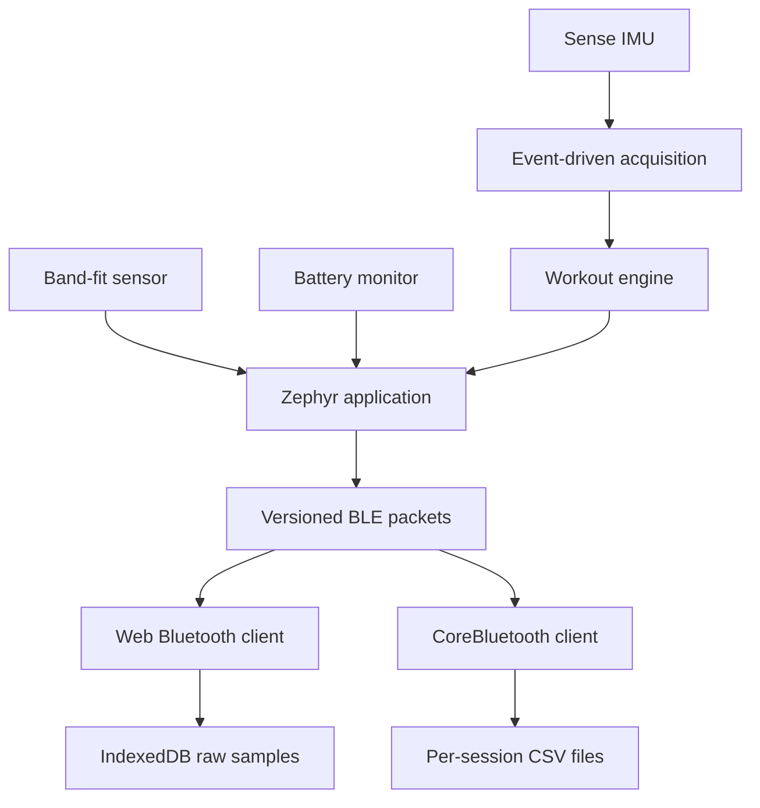

# Technical architecture

## Data path

```mermaid
flowchart TD
    IMU[Sense IMU] --> Acquisition[Event-driven acquisition]
    FSR[Band-fit sensor] --> Firmware[Zephyr application]
    Battery[Battery monitor] --> Firmware
    Acquisition --> Engine[Workout engine]
    Engine --> Firmware
    Firmware --> Protocol[Versioned BLE packets]
    Protocol --> Browser[Web Bluetooth client]
    Protocol --> Native[CoreBluetooth client]
    Browser --> IndexedDB[IndexedDB raw samples]
    Native --> CSV[Per-session CSV files]
```

## Embedded stack

- Seeed Studio XIAO nRF54L15 Sense application core
- Nordic nRF Connect SDK with Zephyr RTOS
- Zephyr sensor, GPIO, ADC, regulator, and Bluetooth APIs
- interrupt-driven IMU sampling with a timed fallback
- hardware floating point and fixed-duration feature windows

Development flashing currently uses the module's USB-C-connected CMSIS-DAP
probe. A production board should expose SWDIO, SWCLK, RESET, ground, and target
voltage for a J-Link or pogo-pin fixture. MCUboot signing and the coordinated
Bluetooth update implementation have been built and tested during development.
Production signing, authenticated device enrollment, physical rollback testing,
and device-specific calibration validation remain release requirements.

## Custom hardware

The fabricated V1 PCB uses a NINA-B302 module based on the Nordic nRF52
architecture. Initial bring-up verified power and J-Link/SWD access. Sensor
interfaces are still being debugged, so the board is documented as an active
engineering prototype rather than a fully validated product revision.

Public hardware material is organized in the
[hardware portfolio](hardware/README.md), with a dedicated
[Altium workspace](hardware/altium/README.md) for design-review artifacts.

## Data contract

Current nRF54 companion applications accept telemetry V3, V4, and V5, with
version-specific integrity and load information. Boot, session, packet, sample,
and dropped-sample counters make discontinuities observable where the version
provides them. Arduino/nRF52840 V2 telemetry is rejected. Historical recordings
and saved-data migrations are retained; retiring device support does not erase
existing user history.

Product-specific packet layouts, pin assignments, and calibration values are
kept in the private engineering repository.

## Algorithms

Current activity and workout metrics use explainable signal thresholds,
filtered features, and timing rules. A learned classifier would only be
appropriate after collecting labeled data from multiple subjects and evaluating
with subject-separated validation.
